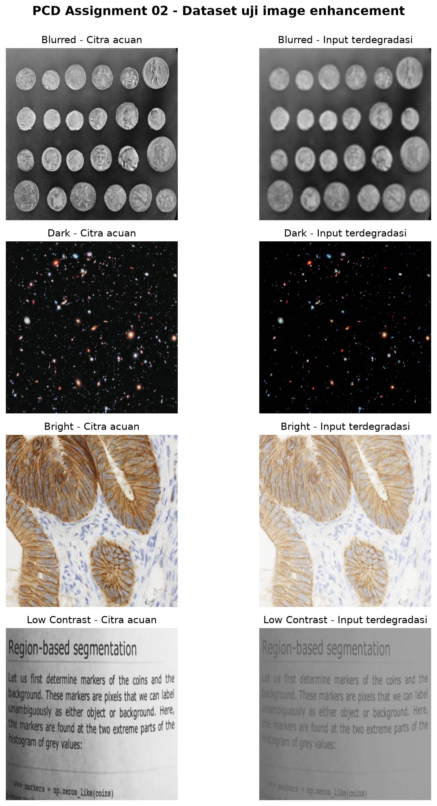
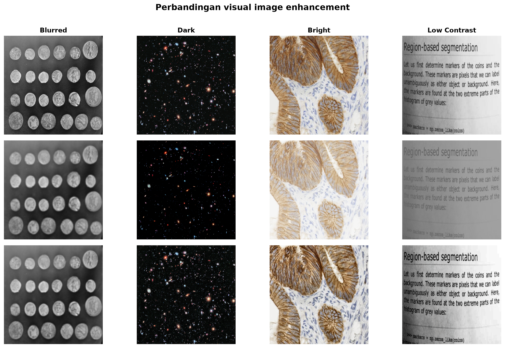
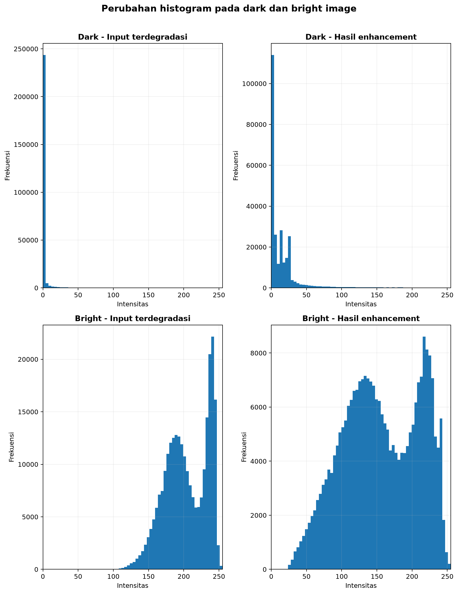
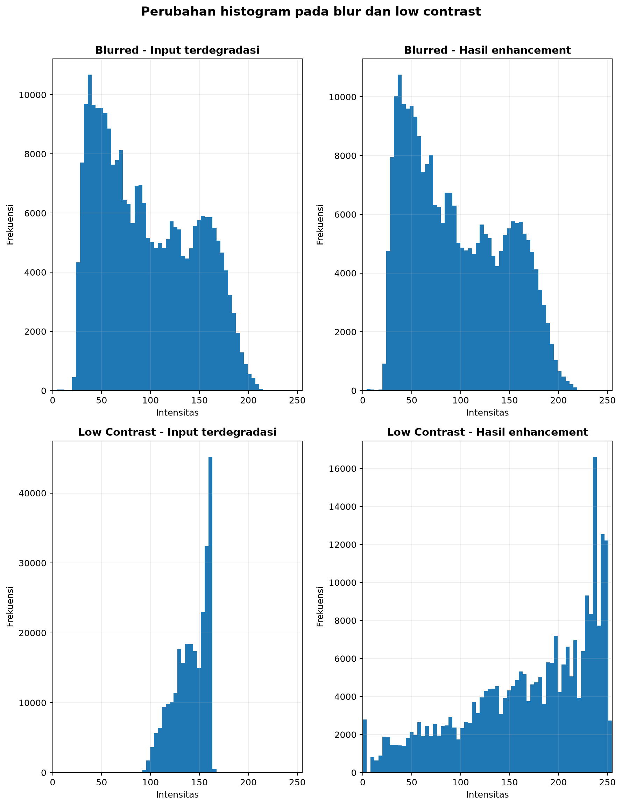

# PCD_Assignment02: Analisis Image Enhancement pada Berbagai Kondisi Citra

Laporan penugasan mata kuliah Pengolahan Citra Digital. Repositori ini berisi pengujian metode *image enhancement* pada empat kondisi citra yang berbeda, yaitu citra blur, citra terlalu gelap, citra terlalu terang, dan citra dengan kontras rendah.

Notebook interaktif juga dapat dijalankan langsung di Google Colab melalui tombol di atas.

## Citra Uji dan Metodologi

Eksperimen menggunakan empat citra berukuran 512 × 512 piksel. Setiap citra dipilih karena memiliki karakteristik yang sesuai dengan jenis degradasi yang diuji:
* **Coins**: memiliki banyak tepi lingkaran dan relief halus sehingga perubahan ketajaman mudah diamati pada pengujian *blur*.
* **Hubble Deep Field**: memiliki latar gelap dengan banyak objek redup sehingga sesuai untuk pengujian *dark image*.
* **Immunohistochemistry**: memiliki area terang, warna jaringan, dan detail lokal sehingga sesuai untuk pengujian *bright image*.
* **Scanned Page**: memiliki pemisahan yang jelas antara teks dan latar sehingga perubahan kontras mudah diamati.

Setiap citra acuan diberi degradasi dengan parameter tetap. Coins diberi Gaussian blur dengan sigma 2.2, Hubble Deep Field digelapkan menggunakan gamma 2.20, Immunohistochemistry diterangkan menggunakan gamma 0.45, dan rentang intensitas Scanned Page dikompresi menjadi 32% di sekitar *mid-gray*. Hasilnya kemudian diproses dengan metode yang sesuai: **Unsharp Masking** untuk blur, **Gamma Correction + CLAHE** untuk citra gelap dan terang, serta **Percentile Contrast Stretching + CLAHE** untuk citra berkontras rendah.

Citra acuan dipertahankan agar hasil enhancement dapat dibandingkan secara objektif menggunakan MSE, PSNR, dan SSIM. Selain itu, brightness, RMS contrast, sharpness, entropy, serta histogram digunakan untuk membantu menjelaskan perubahan karakter citra.

## Analisis Visual dan Hasil Enhancement

### Pengaruh Metode Image Enhancement

*(Note: Baris pertama merupakan citra acuan, baris kedua merupakan input setelah degradasi, dan baris ketiga merupakan hasil enhancement. Kolom dari kiri ke kanan menunjukkan Blurred, Dark, Bright, dan Low Contrast. Seluruh hasil diproses menggunakan algoritma yang sama dengan notebook).*

Perubahan pada citra **Coins** terutama terlihat pada batas dan relief koin. Gaussian blur menurunkan detail frekuensi tinggi, kemudian Unsharp Masking memperkuat kembali transisi tepi yang masih tersisa. Meskipun hasilnya lebih tajam, detail yang sudah hilang akibat blur tidak dapat dipulihkan sepenuhnya hanya dengan proses sharpening.

Pada **Hubble Deep Field**, gamma correction menaikkan luminance sehingga bintang dan objek redup yang sebelumnya hampir tidak terlihat kembali muncul. Pada **Immunohistochemistry**, gamma correction menekan dominasi intensitas tinggi sehingga struktur jaringan kembali lebih dekat dengan citra acuan. Sementara itu, pada **Scanned Page**, contrast stretching memperlebar rentang intensitas dan membuat pemisahan antara teks dan latar menjadi lebih jelas. CLAHE kemudian memperkuat kontras lokal pada tiga kasus tonal tersebut.

### Analisis Perubahan Histogram

Untuk melihat perubahan distribusi intensitas, histogram dikelompokkan menjadi dua pasangan pengamatan:

| Exposure: Dark dan Bright | Detail: Blur dan Low Contrast |
| :---: | :---: |
|  |  |

Hasil histogram menunjukkan pola yang berbeda pada setiap jenis degradasi:
* **Dark image** memiliki distribusi yang menumpuk pada intensitas rendah. Setelah enhancement, distribusinya bergeser ke rentang yang lebih tinggi sehingga detail redup kembali terlihat.
* **Bright image** menunjukkan dominasi intensitas tinggi. Gamma correction menggeser distribusi kembali ke rentang tengah dan CLAHE memperlebar variasi lokal.
* **Low-contrast image** memiliki sebaran intensitas yang sempit. Percentile stretching memperluas sebaran tersebut sehingga perbedaan objek dan latar meningkat.
* **Blurred image** tidak mengalami perubahan histogram sebesar kasus tonal karena target utama Unsharp Masking adalah memperkuat detail spasial dan tepi, bukan menggeser brightness global.

## Evaluasi Kuantitatif

Tabel berikut merangkum tingkat kemiripan input terdegradasi dan hasil enhancement terhadap citra acuan:

| Kondisi | Tahap | MSE ↓ | PSNR (dB) ↑ | SSIM ↑ |
| :--- | :--- | ---: | ---: | ---: |
| **Blurred** | Degraded | 129.56 | 27.01 | 0.7928 |
| *(Coins)* | Enhanced | 98.04 | 28.22 | 0.8287 |
| **Dark** | Degraded | 373.99 | 22.40 | 0.1381 |
| *(Hubble Deep Field)* | Enhanced | 46.67 | 31.44 | 0.8117 |
| **Bright** | Degraded | 2295.46 | 14.52 | 0.8591 |
| *(Immunohistochemistry)* | Enhanced | 236.63 | 24.39 | 0.9233 |
| **Low Contrast** | Degraded | 2248.69 | 14.61 | 0.8010 |
| *(Scanned Page)* | Enhanced | 176.85 | 25.65 | 0.9523 |

*Data lengkap hasil eksperimen tersimpan di [enhancement_metrics.csv](data/output/enhancement_metrics.csv).*

Hasil kuantitatif mengonfirmasi pengamatan visual:
1. **Dark image** mengalami peningkatan SSIM terbesar, dari 0.1381 menjadi 0.8117, dan PSNR meningkat sekitar 9.04 dB. Informasi tonal pada Hubble Deep Field masih tersimpan setelah degradasi gamma sehingga sebagian besar detail dapat dimunculkan kembali.
2. **Low Contrast** menghasilkan SSIM tertinggi setelah enhancement, yaitu 0.9523. RMS contrast juga meningkat dari 17.33 menjadi 66.48, sesuai dengan perubahan visual pada pemisahan teks dan latar.
3. **Blurred image** tetap menunjukkan peningkatan PSNR dan SSIM, tetapi kenaikannya lebih kecil dibanding kasus tonal. Gaussian blur telah menghilangkan sebagian informasi frekuensi tinggi sehingga sharpening hanya dapat memperkuat detail yang masih tersisa.

## Kesimpulan

Berdasarkan hasil eksperimen pada keempat kondisi citra:
* Untuk citra yang terlalu gelap atau terlalu terang, **Gamma Correction + CLAHE** efektif mengembalikan luminance dan memperjelas detail lokal selama informasi belum hilang akibat clipping.
* Untuk citra dengan kontras rendah, **Percentile Contrast Stretching + CLAHE** mampu memperlebar rentang intensitas dan menghasilkan SSIM tertinggi pada pengujian Scanned Page.
* Untuk citra blur, **Unsharp Masking** meningkatkan ketajaman tepi dan fidelity terhadap citra acuan, tetapi tidak dapat mengembalikan seluruh detail frekuensi tinggi yang telah hilang saat proses blur.

## Menjalankan Notebook

Notebook dapat dieksekusi langsung melalui [Google Colab](https://colab.research.google.com/github/hanafishiddiq/PCD_Assignment02/blob/main/PCD_Assignment02.ipynb).
